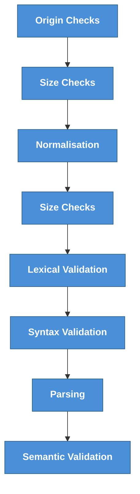

# Input Validation
---
## Wnat to see something cool? Look at me sending an email.

---
## Overview
Input validation is used to solve the problem that complex code's correctness is hard to verify. For example parsers are really complex so you want to protect them using a much simpler code.

Input validation is a compensating control. It is impossible to implement it perfectly. Input validation is a trade-off between application performance, security and development time.

Today we try to give you a structured approach to find the right balance.

---
## Short intro on terms

- Lexical
- Parser
    In formal language theory and computer science, parsing is the process of analyzing a sequence of symbols or tokens according to the rules of a specific formal grammar. Its primary goal is to determine whether the input string belongs to the language defined by that grammar and to reveal its underlying syntactic structure.
- Syntax
- Semantics
- contextual validation

Formal Language

Regular language

Finite language is the best
contex free grammar is easier than one with context

https://en.wikipedia.org/wiki/Chomsky_hierarchy
---
Sanitasation, validation when and how
---
Validation Hierarchy Values
From the least to most trusted
21-May-2026
• TOP (⊤): We don’t know what it is, but we are not trusting it!
• RAW: Untrusted, unvalidated; directly from external sources
• SYNTACTIC: Parsed; conforms to expected grammar (e.g., is this a valid integer?)
• SEMANTIC: Domain-valid (e.g., is this birth date in the past or future?)
• CONTEXTUAL: Valid for the specific use context (e.g., properly escaped for SQL)
• CLEAN: Fully trusted; constants, literals
Different data sinks require different minimum levels:
• Memory allocation size → SYNTACTIC is sufficient
• Date fields → SEMANTIC required
• SQL query parameters → CONTEXTUAL required

PAPI: Provenance-Aware Parse
Insertion for LangSec Mediation
J. Peter Brady and Sean W. Smith
Dartmouth College, Hanover NH

---
## Origin Validation
- IP address verification
- Access key (token) authentication
- Verify source of the request (taint tags in distributed processing)
- Message signing
---
## Size Validation
- Is message reasonably long?
- Are all fields reasonably long as well?
- Check if input exceeds acceptable limits (e.g., > 1000 bytes)
---
## Normalisation and folding
- what is normalisation and folding?
- NF(K)C vs NF(K)D -> implication on length
- 
- Use unicode normalisation
- Recheck size after normalisation and folding -> sometime size change just because you change to upper case
    https://devblogs.microsoft.com/oldnewthing/20241007-00/?p=110345

---
## Lexical Validation
Content uses right characters and encoding?
- Normalize encoding, reject invalid chars
- Allow only certain character categories (i.e.: Only latin chars, uppercase letters etc.)
- Allow only certain chars (i.e.: ' for names for our Irish friends but not .)
- Validate UTF-8 encoding
- Normalize unicode bytes using composing representation (be aware of possible extension of size)
---
## Syntax Validation
Is the format right, can I understand the input?
- JSON double property check
- JSON extra property during deserialization
- Email address should adhere to standard
- Use `JSON.Valid()` to verify structure
---
## Parsing

Parsing is a pretty complex  
Implement JSON unmarshal using various libraries
- Stock encoding/json
- goccy/go-json
- json-iterator/go
- GoJay
- segmentio/encoding/json

---
## Semantic Validation
Does it make sense?
- Is price of goods positive?
- Is this address actually exist?
- Is this filetype make sense?
- Is this email controlled by the user?
- Is cryptographic controls applied are strong and passes validation?
- Is this url points to public or private resource?
- Is this user exist in the DB?
- Uniqueness check
- Dereferencing
- TOCTOU locking

Semantic check is very hard often time requiring formal verification technique for the ultimate assurance but good old threat modeling can help. Ask yourself what can go wrong?
---
## Contextual

Complete the following sentence
Paris is to □ what London is to □
A natural answer is
Paris is to France what London is to England
Another answer is also a valid sentence
Paris is too crowded for you, and that’s what London is to me

JunId: Fast Intersection with Incomplete Sentences
Computing injection grammars from templates
Eric Alata Pierre-François Gimenez
LangSec 2026

---

## Demo 1
AI https://embracethered.com/blog/posts/2024/claude-hidden-prompt-injection-ascii-smuggling/
---
### Demo 2
See code...
---
Scaling

- create the patterns and antipatterns
- create a rule set to find patterns and not anti-patterns
    - pattern is the way to do validation, trying to write rules to all the ways how people can screw up is hard. Typically create antipattern rules for things you know exist. 
- you can use AI to create your own static analysis rules it can be super helpful
- 
---
## Pattern

How do we verify? We look for positive indicators. 
They can be standard libraries/functions need to be applied under certain conditions. 

- Don't fix data if security matters.
- Never change the data after validation. Folding and normalisation should happen before validation, making sure that you don't reintroduce rejects. Propagate normalised data.
- Yes you can use regex, but should you? No, regex is hard if you want simple.
- Trade-off especially at semantic level cost of validation vs risk
- Know when to be careful
    - complex input is where you can embed context several layer deeply (Matroska)
    - When the standard is loose for example JSON.

    - If you can't validate origin be super diligent.
    - If the input is has arbitary length.
    - If the input is passed around verabatim between componenets.

---
## Validation in distributed applications

- Validate all sources (file, config etc.)
- Validate inputs that you processs/parse skip what you don't process in distributed systems.
- In distributed systems validate everywhere based on the assumption made in the component. If validation is performance prohibitive do as much as you can.
