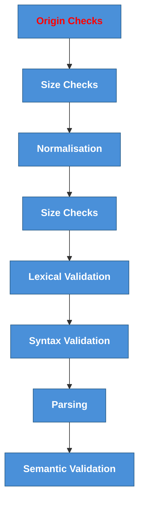
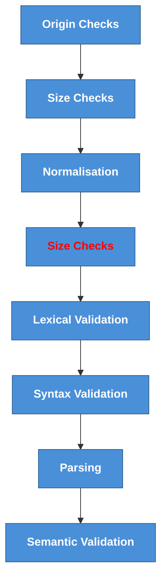
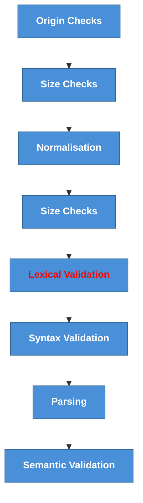
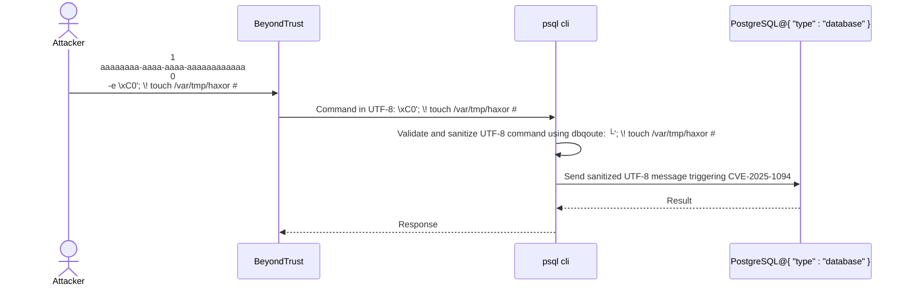
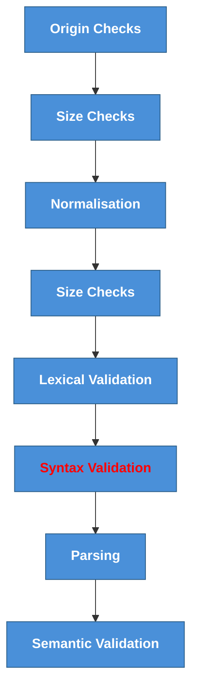
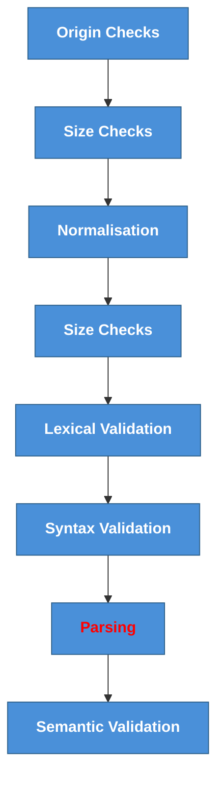
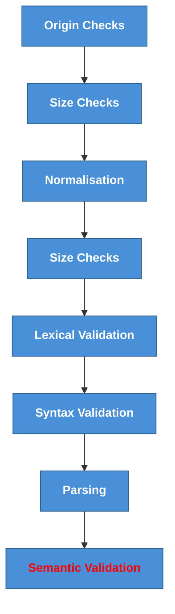
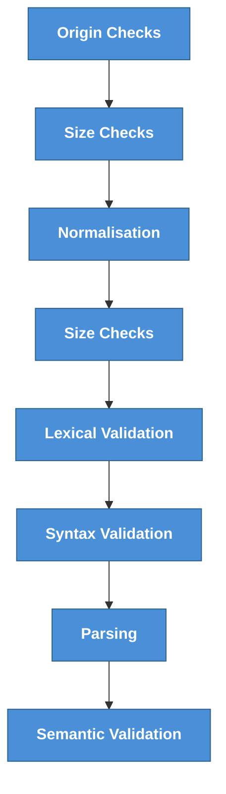

# Input Validation

---  

## Want to see something cool? Look at me sending an email.


---
## Introduction
Nilufer
Bazil

The thoughts and opinions expressed here are our own and not of our previous or current employers.
---

Have you ever woken up in the middle of the night jetlagged realising that you need to make a talk in front of lot of people in 4 hours and you didn't start preparing? No this is not that talk but was inspired by that talk.

:::note
The audience were developers/ security pros working on a latency sensitive distributed system. The talk was about fitting input validation into your latency envelop.
---
## Overview

Input validation is used to solve the problem that complex code's correctness is hard to verify. 


:::note
For example parsers are really complex so you want to protect them using a much simpler code.

I personally struggled to answer the question that every security professional is the most afraid of. Is this input validation secure? 

It is nearly impossible to implement input validation perfectly. Input validation is a trade-off between application performance, security and development time. When you are looking at distributed systems. Today we try to give you a structured approach to find the right balance.
---
## Requirements
- Should be a valid and existing email address.
- Should not crash parsers.
- The age of the person should be beleivable.
- The service should greet the user if they are on the VIP list.
- The service should accept all valid JSON in accordance to RFC TBD.
- The service should only accept valid UTF-8 encoded strings.
- The service should accept names from any language in the world.

:::note
This doesn't seems crazy certainly better than for example the http5 specification.
https://html.spec.whatwg.org


---
## Is this valid or not?

{
"name":"Pérez Zoé2",
"nAmE": "Pérez Zoé",
"Email": "john🐶@💰xmple.com"
"email": "john.smith@example.com"
"agE": "4566789",
"age": 26
}
:::note
At this point you want to take that beach holiday you dreamed about.
but fear not we will use the power of math to make order in the chaos
---
## Let's see the structure


:::note
Order matters a lot.  

Cardinal sins:
Chnaging the data and not revalidate the data propagated.
Fixing the data especially if it is not revalidated as new data that is fixed.
Looking at not desirable inputs.
Not protecting the validation logic from tampering (client side validation, accessible data validation configuration).
Multiple data path with different validations.
---
## Origin Validation
- IP address verification
- Access key (JWT token) authentication
- Verify source of the request (taint tags in distributed processing)
- Message signing
- Restrict URI or path 

:::note
**Input sometime comes from strange places like files** 
You want to establish the provenance of the data.
Sometime you have to do some work to figure out the origin. Sometime you have to fetch a file based on the path or URI. It is always a good idea to do full validation including semantic on the references.

If you need to validate token do it the right way with standard libraries used the right way!

Be mindful of TOCTOU (change to symlink on the fly, or move directory for path traversal, attacker controlled server may change resource under URI or you may leak information to attacker controlled server while fetching resource)

the attacker provides a path such as “a/b/c/../../etc/passwd”, and renames “a/b/c” to “a/b” while the open operation is in progress. https://go.dev/blog/osroot
---

Trick with a symlinked directory-> application only accepts files in a certain directory that the user has read write access create a symlink for the daemon to read any file...

---

---
## Size Validation
- Is message reasonably long?
- Are all fields reasonably long as well?
- Check if input exceeds acceptable limits (e.g., > 1000 bytes)
:::note
Keep in mind size can change when you decode or normalise so a quick size check doesn't hurt after doing that operation.

There are different length value depending on what you look at.  You can't tell how long is the buffer by looking at the length of the string encoding can change the legth.
---
A slide about how chacters is not equal to buffer size.

https://github.com/golang/go/issues/41185
---

---
## Normalisation
- what is normalisation and why we do it.
- Normalize unicode bytes using composing representation (be aware of possible extension of size)
    - NF(K)C vs NF(K)D -> implication on length
- Use unicode normalisation before validating.
- Recheck size after normalisation and folding -> sometime size change just because you change to upper case
    https://devblogs.microsoft.com/oldnewthing/20241007-00/?p=110345

:::note
Normalisation is the process of transforming data into a unified form so it's easier to compare and sort. Key is here that it is a transformation. Therefore it must be done before validation or the result need to be revalidated.
---
Code of how not to do normalisation
https://www.sentinelone.com/vulnerability-database/cve-2021-43798/
https://github.com/grafana/grafana/commit/c798c0e958d15d9cc7f27c72113d572fa58545ce
---

---
## Lexical Validation
Content uses right characters and encoding?
- Validate encoding, reject invalid chars
- Allow only certain character categories (i.e.: Only latin chars, uppercase letters etc.)
- Allow only certain chars (i.e.: ' for names for our Irish friends but not .)
- Validate UTF-8 encoding

:::note
This part reduces the opportunity of all kind of monkey business. 

Example:

Remote code execution in beyondtrust privileged remote access. Interesting observation performance optimisation was the root cause again....

The chain:
https://seclists.org/oss-sec/2025/q1/140

The bug:
https://www.rapid7.com/blog/post/ra-cve-2024-12356-analysis/

JSON only allows UTF-8 now but it used to be UTF-16 and UTF-32 as well in RFC 4627
---

:::note

"\xC0&#59; \! touch /var/tmp/haxor #" will become the gskey variable that is being passed to PSQL

---
Code from psql focusing of optimisation

````
/*
 * Escaping arbitrary strings to get valid SQL literal strings.
 *
 * Replaces "'" with "''", and if not std_strings, replaces "\" with "\\".
 *
 * length is the length of the source string.  (Note: if a terminating NUL
 * is encountered sooner, PQescapeString stops short of "length"; the behavior
 * is thus rather like strncpy.)
 *
 * For safety the buffer at "to" must be at least 2*length + 1 bytes long.
 * A terminating NUL character is added to the output string, whether the
 * input is NUL-terminated or not.
 *
 * Returns the actual length of the output (not counting the terminating NUL).
 */
static size_t
PQescapeStringInternal(PGconn *conn,
					   char *to, const char *from, size_t length,
					   int *error,
					   int encoding, bool std_strings)
{
	const char *source = from;
	char	   *target = to;
	size_t		remaining = length;

	if (error)
		*error = 0;

	while (remaining > 0 && *source != '\0')
	{
		char		c = *source;
		int			len;
		int			i;

		/* Fast path for plain ASCII */
		if (!IS_HIGHBIT_SET(c)) // <--- [2]
		{
			/* Apply quoting if needed */
                // ... snip...
			/* Copy the character */
                // ... snip...
		}

		/* Slow path for possible multibyte characters */
		len = pg_encoding_mblen(encoding, source); // <--- [3]

		/* Copy the character */
            // ... snip...

		/*
		 * If we hit premature end of string (ie, incomplete multibyte
		 * character), try to pad out to the correct length with spaces. We
		 * may not be able to pad completely, but we will always be able to
		 * insert at least one pad space (since we'd not have quoted a
		 * multibyte character).  This should be enough to make a string that
		 * the server will error out on.
		 */
		if (i < len)
		{
			if (error)
				*error = 1;
			if (conn)
				libpq_append_conn_error(conn, "incomplete multibyte character");
			for (; i < len; i++)
			{
				if (((size_t) (target - to)) / 2 >= length)
					break;
				*target++ = ' ';
			}
			break;
		}
	}

	/* Write the terminating NUL character. */
	*target = '\0';

	return target - to;
}
````

---

---
## Syntax Validation
Is the format right, can I read the input?
- Do JSON has duplicate property?
- JSON depth limit
- JSON key case normalisation
- JSON Schema validation if you have a schema
- JSON extra property during deserialization
- Large number with ambigious decoding
- Unexpected support for comments
- value without qoutes
- Email address should adhere to the standard 
- Use `JSON.Valid()` to verify structure
- Non standard extensions i.e. comments, data types


:::note
We promised you a joke about 3 parsers going into a bar and disagreeing on something. 

So 3 parser goes into bar they all get an _User document but Erlang is super impatient and 


One parser might see the same JSON differently. One could be stripping comments out other mught ignore it or fail.


Example:
Apache CouchDB privilege escalation
https://nvd.nist.gov/vuln/detail/cve-2017-12635

description:
https://lists.apache.org/thread/n73xcy317gptmbmh5cf27bwny8wjh0cv
https://justi.cz/security/2017/11/14/couchdb-rce-npm.html

Good luck with the emial standard by the way: https://datatracker.ietf.org/doc/html/rfc5321#section-4.1.2
A few valid one:
"><script>alert(1);</script>"@example.org
user+subaddress@example.org
user@[IPv6:2001:db8::1]
---
Couchdb code
---

---
## Parsing

Parsing is a pretty complex  
Implement JSON unmarshal using various libraries
- Stock encoding/json
- goccy/go-json
- json-iterator/go
- GoJay
- segmentio/encoding/json

:::note
Discussing parsers and their implementation is beyond the scope of this talk.  But know that performance matter a lot for most parsers so they often have performance optimisation that can lead to vulnerabilities. They are also very complex piece of code that are very hard to test. How worried you should be depends on what they need to parse. Inputs that have different context embeded in each other are notoriously hard to write securely. In modern days parsers are often generated based on the inputs grammar making them more robust, but they are still exposed to ambiguity in grammars.

Use the same validation library as the parser!!!!!!
Don't assume test sometime library support non standard features like comments.
---
DEMO! add comment to json , a path, large number, value without qoute
---
---

---
## Semantic Validation
Does it make sense?
- Is this email address owned by the user and exist?
- Is price of goods positive?
- Is this address actually exist?
- Is this filetype make sense?
- Is this email controlled by the user?
- Is cryptographic controls applied are strong and passes validation?
- Is this url points to public or private resource?
- Is this user exist in the DB?
- Uniqueness check
- Dereferencing
- TOCTOU locking

:::note
Semantic is when you connect the world to your input...verify if the email exist, check if the address exist and if is residential etc. This is where your domain model comes in if you have one. Find the invariants the things that always hold true and code them as semantic checks.

Sematic check is an art of finding the balance between security and speed. Sematic checks are often need an expensive trip to a database. 

Semantic check is very hard often time requiring formal verification technique for the ultimate assurance, but good old threat modeling helps. Ask yourself what can go wrong?

Using validator library is encuraged. In many programming languages including go reflection is slow. Avoid if speed matters to you.

https://adehikmat-fr.medium.com/exploring-performance-trade-offs-in-go-reflective-vs-non-reflective-struct-validation-6c8c67c60826

If you have a domain model with business rules you should use them as validation if they are not super expensive to run.  Look at the big picture does the input make sense across fields? What are your invariants. If you have an in distribution problem AI can help you a lot.

Cardinal sins:
- Non idempotent validation (db write or other state change)
- Don't revalidate internally unless you are planning to process
- Don't scatter semantic validation across your code do it in a single place.
---
Demo getting invariants using fable model for email.
---
## Contextual or Pragmatics validation

Complete the following sentence
Paris is to □ what London is to □
A natural answer is
Paris is to France what London is to England

Another answer is also a valid sentence
Paris is too crowded for you, and that’s what London is to me

:::note

The rules can be different depending what you intend to do with that data. If you will plug it into an SQL query or want to use it in a browser response. That's why you validate before use giving you the full context. 

Contextual validation is applying a special set of syntactical rules based on usage. Such as not allowing unescaped qoutes in an SQL query or certain keywords or symbols.  This is one of those special cases where you might want to prefer sanitazion instead of validation. Yes you still want to revalidate after.

Contextual validation/sanitization depends on data processing, do it where you already have the context (in the browser before use in css,href etc.). Be warned there are context that just can't be safely used with untrusted data for example in the middle of script tag.

Common exploitation:
exploit applications mixing instructions with data buffer overflow,underflow, use after free etc
exploit trust in an application aka confused deputy
exploit ambiguity of interpretation aka injection attack

https://cheatsheetseries.owasp.org/cheatsheets/Cross_Site_Scripting_Prevention_Cheat_Sheet.html

JunId: Fast Intersection with Incomplete Sentences
Computing injection grammars from templates
Eric Alata Pierre-François Gimenez
LangSec 2026

---
## Scaling to larger organisations

- create the patterns and antipatterns
- create a rule set to find patterns and not anti-patterns
    - pattern is the way to do validation, trying to write rules to all the ways how people can screw up is hard. Typically create antipattern rules for things you know exist. 
- you can use AI to create your own static analysis rules it can be super helpful
- you can use AI for invariants and semantic validation rules as well for in distribution objects.

---
## Validation in distributed applications

- Validate all sources (file, config etc.)
- Validate inputs that you processs/parse skip what you don't process in distributed systems.
- In distributed systems validate everywhere based on the assumption made in the component. If validation is performance prohibitive do as much as you can.
---
## Hidden Slides
---
## Short introduction into terms
Input is a piece of information that is being passed to our programme.
- Lexical
- Parser
    In formal language theory and computer science, parsing is the process of analyzing a sequence of symbols or tokens according to the rules of a specific formal grammar. Its primary goal is to determine whether the input string belongs to the language defined by that grammar and to reveal its underlying syntactic structure.
- Syntax
- Semantics
- contextual validation
---
## Formal Language

The higher you are in the chomsky hierarchy the harder is to get it right.

LLMs are impossible to get right: https://proceedings.iclr.cc/paper_files/paper/2025/file/123d3e814e257e0781e5d328232ead9b-Paper-Conference.pdf


Regular language

Finite language is the best
contex free grammar is easier than one with context

https://en.wikipedia.org/wiki/Chomsky_hierarchy
---
## Sanitasation, validation when and how

Validation Hierarchy Values
From the least to most trusted
21-May-2026
• TOP (⊤): We don’t know what it is, but we are not trusting it!
• RAW: Untrusted, unvalidated; directly from external sources
• SYNTACTIC: Parsed; conforms to expected grammar (e.g., is this a valid integer?)
• SEMANTIC: Domain-valid (e.g., is this birth date in the past or future?)
• CONTEXTUAL: Valid for the specific use context (e.g., properly escaped for SQL)
• CLEAN: Fully trusted; constants, literals
Different data sinks require different minimum levels:
• Memory allocation size → SYNTACTIC is sufficient
• Date fields → SEMANTIC required
• SQL query parameters → CONTEXTUAL required

PAPI: Provenance-Aware Parse
Insertion for LangSec Mediation
J. Peter Brady and Sean W. Smith
Dartmouth College, Hanover NH
---
## Formal language terms

The alphabet of a formal language consists of symbols that concatenate into strings (also called "words").[1] Words that belong to a particular formal language are sometimes called well-formed words. A formal language is often defined by means of a formal grammar such as a regular grammar or context-free grammar.

Every piece of software that takes inputs contains a de facto recognizer for accepting valid or expected inputs and rejecting invalid or malicious ones. This recognizer code is often ad hoc, spread throughout the program, and interspersed with processing logic (a "shotgun parser"). This lends the processing logic to exploitation and programmers to false assumptions of data safety.

https://langsec.org/occupy/

---
## Pattern




How do we verify? We look for positive indicators. 
They can be standard libraries/functions need to be applied under certain conditions. 

- Don't fix data if security matters.
- Never change the data after validation. Folding and normalisation should happen before validation, making sure that you don't reintroduce rejects. Propagate normalised data.
- Yes you can use regex, but should you? No, regex is hard if you want simple.
- Trade-off especially at semantic level cost of validation vs risk
- Know when to be careful
    - complex input is where you can embed context several layer deeply (Matroska)
    - When the standard is loose for example JSON.

    - If you can't validate origin be super diligent.
    - If the input is has arbitary length.
    - If the input is passed around verabatim between componenets.

---


## Demo 1
AI https://embracethered.com/blog/posts/2024/claude-hidden-prompt-injection-ascii-smuggling/
---
### Demo 2
See code...
---
General advices

Use standards that are common.
Read RFCs.
Learn to read grammars in BNF notation.
Don't use regex if possible if you must you can use xx notation.
Validation failures need to be logged with detailed reason. Never log offending input, if you do remove secrets and encode it in a way that it is secure for the log viewers.